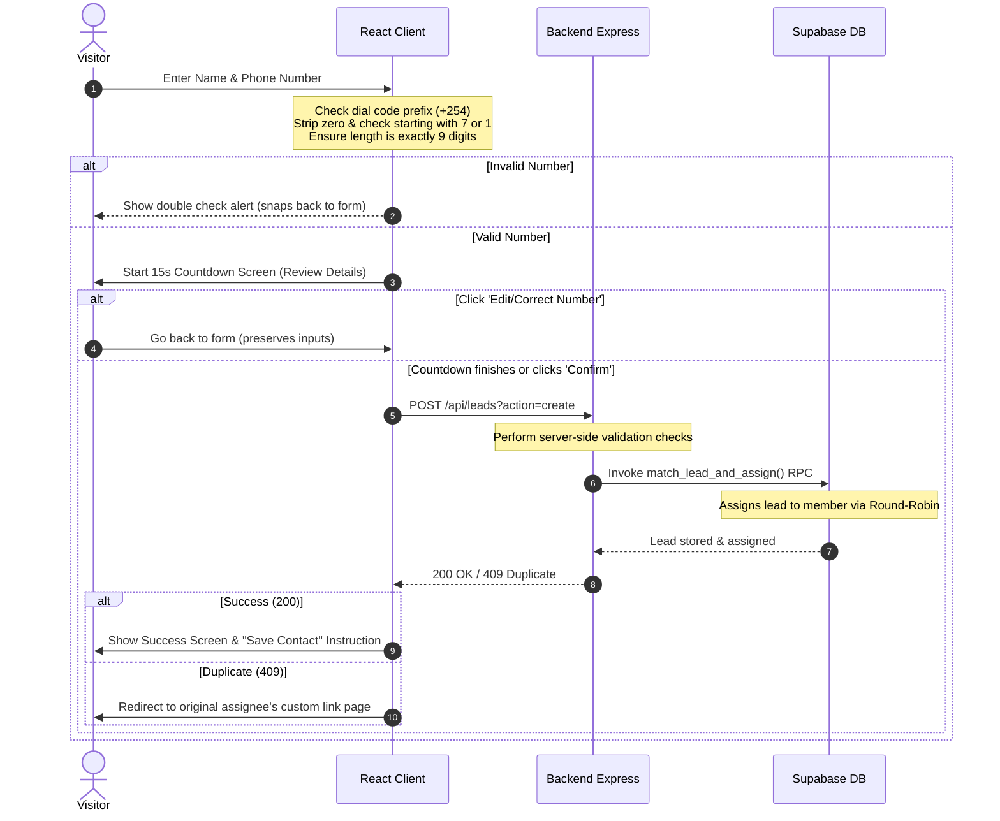
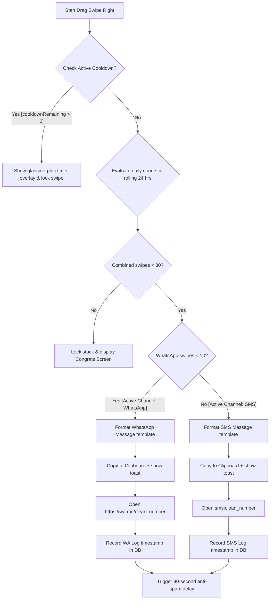
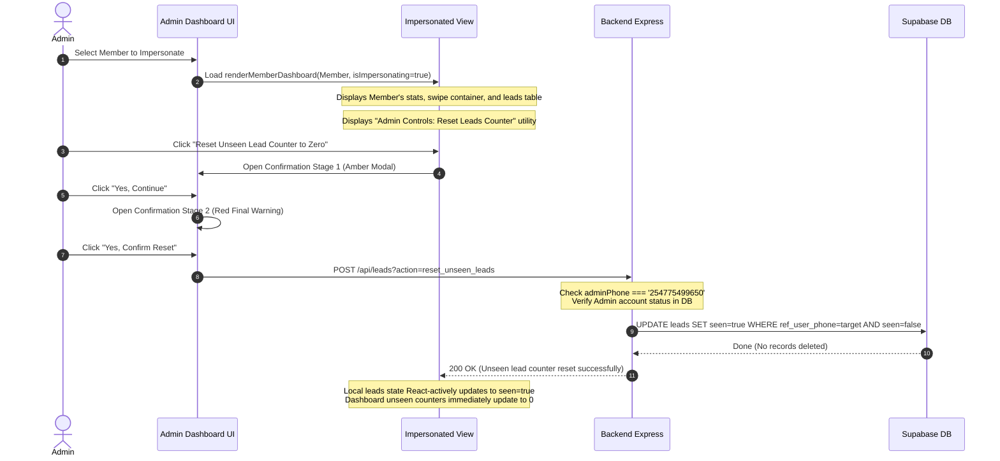

# Detailed System Flow & Architecture

This document provides a comprehensive blueprint of how the **Team Contact & Lead Management System** functions under the hood, mapping the flows for visitors, team members, and administrators.

---

## 1. Lead Registration & Validation Flow



### Detailed Steps:
1. **Visitor Entry:** Visitors navigate to the campaign link (e.g. `http://localhost:3000/?ref=254712345678` or `?group=group_uuid`).
2. **Form-Level Validation:**
   - The user selects their country (Kenya is default, code `+254`).
   - If Kenyan: The phone number must contain exactly 9 digits after removing the dial code and leading zero. It must start with mobile prefixes `7` or `1` (e.g. `07...` or `01...`).
   - If other country: The local part must be between 7 and 15 digits.
   - If invalid: A warning alert is shown, and the user stays on the edit form.
3. **Review & Countdown:**
   - A 15-second visual countdown is initiated. The visitor sees their formatted name and number.
   - They can click **"Edit / Correct Number"** to cancel and return to form fields instantly.
4. **Round-Robin Assignment (Supabase DB RPC):**
   - Once confirmed, the lead is sent to the backend. The backend executes a Database RPC (`match_lead_and_assign`) that routes the lead.
   - If registering via a **Group Link**: The system looks up all active members in the group and assigns the lead to the member who has not received a lead for the longest time.
   - If registering via a **User Referral Link**: The lead is assigned directly to that user.
5. **Duplicate Handling:**
   - If the phone number is already registered under a group, the database returns a `409 Conflict`.
   - The frontend intercepts this and redirects the visitor to the original assigned member's contact card, preventing duplicate distribution.

---

## 2. Tinder-Swipe & Dual-Channel Messaging Flow

Active team members process their assigned leads through a swipe container interface. The messaging channel dynamically transitions to protect sender reputation.

```
Total Daily Limit: 30 Leads per rolling 24 Hours
├─ Swipes 1 to 10: WhatsApp Channel
├─ Swipes 11 to 30: SMS Channel
└─ Swipes 31+: Locked (Congrats screen)
```



### Flow Components:
1. **Status Evaluator (`getSwipeStatus`):**
   - On load and after every log insertion, the dashboard queries all processed communication logs (`__wa_log__` and `__sms_log__`) within the last 24 hours.
   - It computes the channel limit counts and identifies if the active cooldown timer is running.
2. **Pacing Cooldown Lock (90 Seconds):**
   - An anti-spam cooldown of **90 seconds** is enforced immediately after swiping right to message any lead (regardless of the channel).
   - During the cooldown, a glassmorphic card cover overlay blocks all click/drag events and displays a monospace timer counting down.
3. **WhatsApp Phase (1 to 10):**
   - Personalizes the message using the lead's first name.
   - Copies template text to clipboard, fires a success toast, and launches native WhatsApp (`https://wa.me/...`).
   - Inserts a communication log with `name: '__wa_log__'` and `full_number: timestamp`.
4. **SMS Phase (11 to 30):**
   - After 10 swipes, the card footer button styles dynamically change from WhatsApp Green to SMS Blue with a message bubble icon.
   - Personalizes the message using the lead's first name and the dashboard owner's name:
     > *"Hey [Lead]! It's [Owner]. Your registration was received! 🚀 Please save my number as '[Owner]' and reply 'SAVED' on WhatsApp to activate your team access. (Reply STOP to opt out)"*
   - Copies template to clipboard, shows a toast, formats the Kenyan prefix to `254...`, and launches native messaging protocol (`sms:...`).
   - Inserts a log with `name: '__sms_log__'`.
5. **Congrats / Lock Screen:**
   - Swipes are locked when 30 leads (10 WA + 20 SMS) are reached in a rolling 24-hour cycle. The user sees a congrats trophy card.

---

## 3. Super Admin Impersonation & Unseen Leads Reset Utility

The Super Admin (`254775499650`) can securely monitor the downline network and clear unseen notifications from dashboards.



### Key Security Safeguards:
- **Admin Verification:** The backend verifies that the caller's phone number is exactly `'254775499650'` and checks the database to verify their status is active before carrying out database modifications.
- **Contextual Reset UI:** The Reset Leads button is **only** accessible to the admin and is presented contextually within the impersonated dashboard view. The target member is automatically identified, preventing accidental cross-user resets.
- **No Data Deletion:** The counter reset executes via an SQL `UPDATE` setting `seen = true` for currently unseen leads. It does not delete any capture logs, preserving lead history.
